# Guía de Bastionado para Router Cisco RV260

El hardening de un router es un paso de especial importancia en la configuración de un router para aumentar la protección de nuestra red. Esta guía proporciona un listado de apartados a revisar para fortalecer la seguridad del router Cisco RV260, minimizando su superficie de ataque y defendiendo la infraestructura de red contra amenazas externas.

## Cambio de Credenciales Predeterminadas

El primer paso en cualquier proceso de bastionado es cambiar las credenciales predeterminadas:

1.  Navegue hasta "Administración" > "Usuarios".

2.  Cree un nuevo usuario con rol de administrador. Utilice un nombre de usuario no común (evite nombres como admin, root, cisco o el nombre del administrador) y establezca una contraseña robusta.

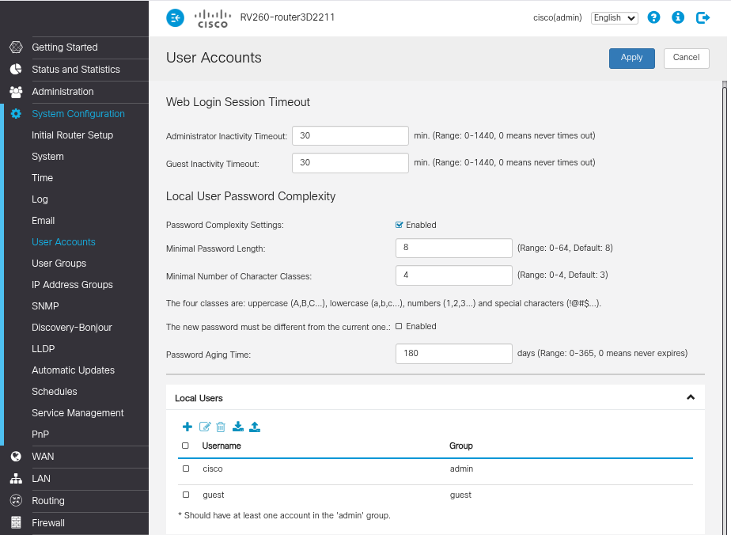

3.  Implemente una política de contraseñas robustas que incluya:

    - Mínimo 12 caracteres.
    - Combinación de letras mayúsculas y minúsculas.
    - Inclusión de números y caracteres especiales.
    - Evitar palabras de diccionario o información personal.

4. Elimine los usuarios predeterminados "cisco" e "invitado".
	

## Actualización de Firmware

Mantener el firmware del router actualizado es crucial para la seguridad, ya que las actualizaciones corrigen vulnerabilidades conocidas. Se recomienda actualizar el firmware de forma regular:

1. Vaya a "Administración" > "Actualización de firmware" (o similar, dependiendo de la versión).

2. Verifique la versión de firmware actualmente instalada en el router.

3. En esta sección, puede cargar un archivo de firmware descargado del sitio web oficial de Cisco o utilizar la función de actualización automática para instalar la última versión desde el repositorio de Cisco.

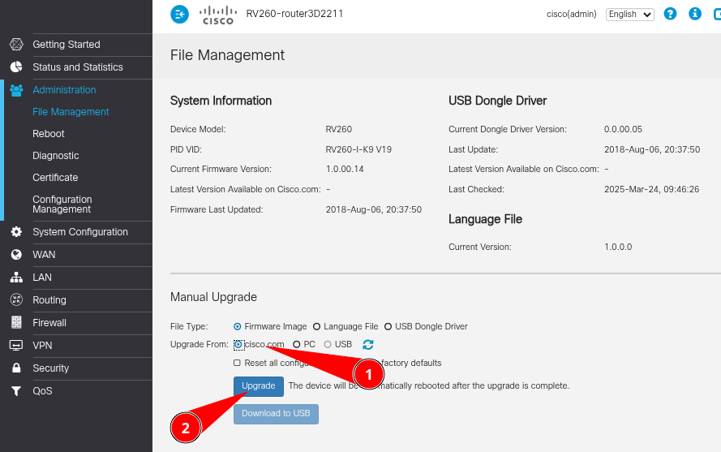

4. Configure el sistema para buscar actualizaciones de forma periódica. Puede optar por recibir notificaciones para realizar la actualización manual o programar actualizaciones automáticas fuera de las horas de trabajo para evitar interrupciones del servicio.

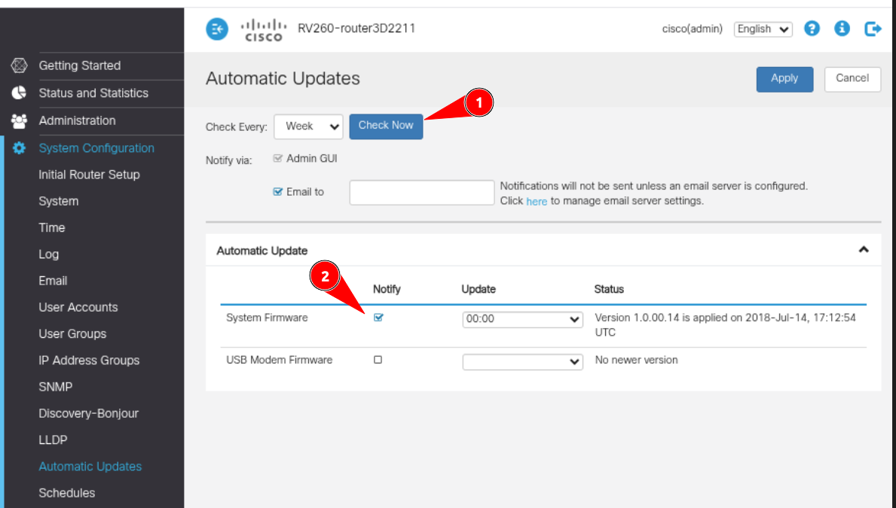

### Certificados

Para mitigar los ataques de tipo "man-in-the-middle", es recomendable reemplazar el certificado autofirmado del router por uno emitido por una entidad de confianza. Puede instalar un certificado emitido por la Autoridad de Certificación (CA) de su red. En caso de no disponer de una CA, puede instalar el certificado directamente en los navegadores que se utilizarán para acceder al router.

Esta medida de seguridad elimina las advertencias de seguridad que muestran los navegadores al acceder al router con el certificado autofirmado y proporciona una capa de seguridad adicional. Si un atacante intentara suplantar la identidad del router, el navegador detectaría que el certificado no es válido y alertaría al usuario, previniendo el acceso no autorizado.

Consulte la documentación del router para obtener instrucciones detalladas sobre cómo instalar un certificado personalizado.

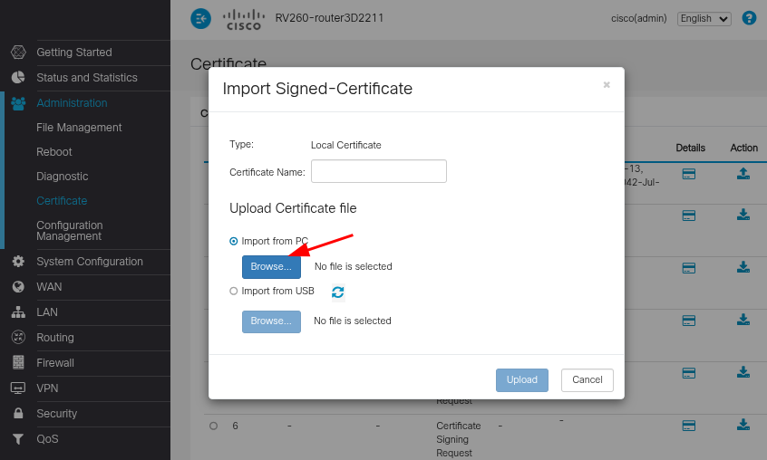

## Configuración Básica de Seguridad

### Configuración Básica de Seguridad

1. Habilite el firewall: Marque la casilla "Enable" bajo la sección "Firewall".
2. Active la protección contra ataques de Denegación de Servicio (DoS): Seleccione "Enable" en la opción "DoS (Denial of Service)".
3. Bloquee las solicitudes WAN: Active "Enable" en "Block WAN Request".

### Configuración de Servicios

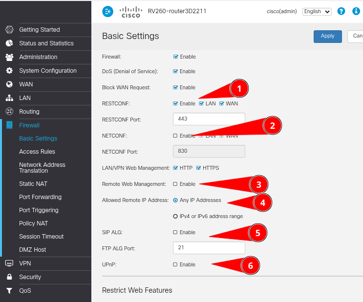

1. **RESTCONF:**
   - Habilite RESTCONF: Marque "Enable".
   - Configure el acceso desde LAN y WAN.
   - Establezca el puerto RESTCONF en 443.
   - *Descripción:* RESTCONF es una interfaz HTTP que permite acceder a datos definidos en YANG, lo que facilita la gestión del dispositivo mediante operaciones RESTful.

2. **NETCONF:**
   - Por seguridad, mantenga NETCONF deshabilitado.
   - Si necesita habilitarlo, restrinja el acceso únicamente a la LAN.
   -  *Descripción:* NETCONF es un protocolo que permite instalar, manipular y eliminar la configuración del dispositivo mediante operaciones RPC.

3. **Gestión Web:**
   - Configure la gestión web para LAN/VPN, permitiendo tanto HTTP como HTTPS.
   - **Importante:** Deshabilite la gestión web remota. Desmarque "Enable" en "Remote Web Management".

4. **Acceso Remoto:**
   - Si es imprescindible habilitar el acceso remoto, restrinja las direcciones IP permitidas.
   - En lugar de "Any IP Addresses", utilice un rango específico de direcciones IPv4 o IPv6.

5. **Otros Servicios:**
   - **SIP ALG:** Manténgalo deshabilitado, a menos que sea estrictamente necesario para aplicaciones VoIP específicas. SIP ALG puede ayudar a prevenir problemas de firewall en llamadas SIP, pero también puede causar problemas de conectividad.
   - **FTP ALG:** Configure el puerto FTP ALG en 21 si utiliza FTP. FTP ALG permite el correcto funcionamiento del protocolo FTP a través del firewall, gestionando los puertos necesarios para las transferencias de datos.

6. **UPnP:**
   - **Crítico:** Deshabilite UPnP. Desmarque la casilla "Enable" para evitar la apertura automática de puertos y posibles vulnerabilidades.

7. Habilite la protección contra ataques de denegación de servicio (DoS).

## Reglas de acceso

Las reglas de firewall deben configurarse para permitir únicamente el tráfico necesario y segmentar las redes, limitando así la superficie de ataque.

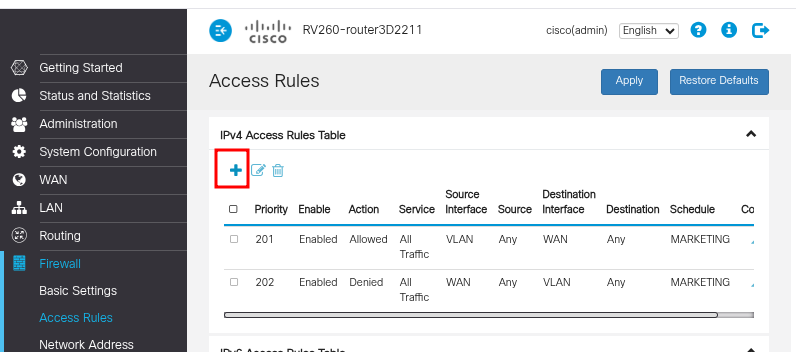

### Creación de reglas

1. Seleccione el servicio que desea permitir o bloquear.

2. Seleccione la interfaz de red de origen y el rango de direcciones IP de origen.

3. Seleccione la interfaz de red de destino y el rango de direcciones IP de destino.

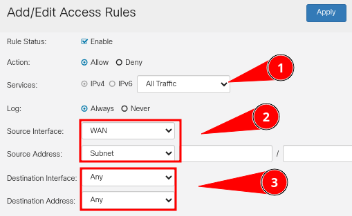

### Reglas recomendadas

- Deniegue el acceso al router desde la red WAN y desde las subredes internas que no lo necesiten.

- Deniegue el tráfico desde la WAN hacia las VLAN predeterminadas.

- Autorice solo el tráfico entre dispositivos dentro de la misma red (LAN).

- Bloquee todo el tráfico innecesario entre VLANs.

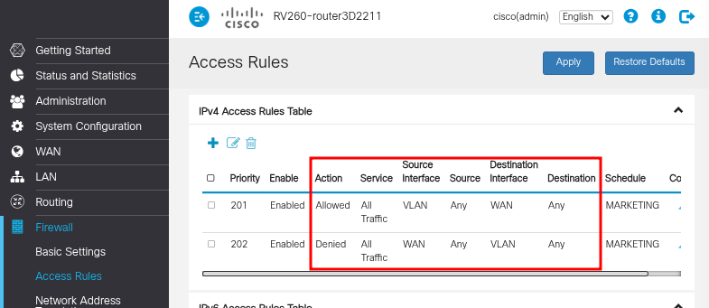

Es fundamental ordenar las reglas según la prioridad de ejecución deseada.

## Deshabilitación de Servicios Innecesarios

### Servicios de Descubrimiento

Los protocolos de descubrimiento pueden revelar información sensible sobre la red:

1. Desactive el Protocolo de Descubrimiento de Cisco (CDP) en las interfaces conectadas a redes no confiables. Utilice el comando `no cdp enable`.

2. Deshabilite el Protocolo de Descubrimiento de Capa de Enlace (LLDP). Utilice los comandos `no lldp transmit` y `no lldp receive`.

### Servicios Web y Administrativos

Limite los servicios administrativos para reducir la superficie de ataque:

1. Desactive el servidor HTTP si no es necesario. Utilice el comando `no ip http server`.

2. Si necesita acceso remoto, considere utilizar HTTPS en lugar de HTTP, pero establezca restricciones de acceso por IP.

3. Deshabilite el Protocolo Simple de Administración de Red (SNMP) si no se utiliza.

4. Si SNMP es necesario, actualice a SNMPv3 con autenticación y cifrado.

### Otros Servicios Innecesarios

Deshabilite otros servicios que puedan representar riesgos de seguridad:

1. Desactive las redirecciones IP para evitar posibles ataques de redirección. Utilice el comando `no ip redirects`.

2. Configure los servicios TCP Keepalive para eliminar conexiones huérfanas. Utilice los comandos `service tcp-keepalive-in` y `service tcp-keepalive-out`.

3. Deshabilite el Protocolo de Resolución de Direcciones Proxy (Proxy ARP) si no es necesario.

4. Considere deshabilitar servicios como Bonjour, UPnP y IPv6 si no son necesarios en su entorno. Esto se recomienda especialmente en entornos de máxima seguridad.
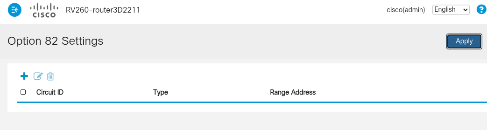

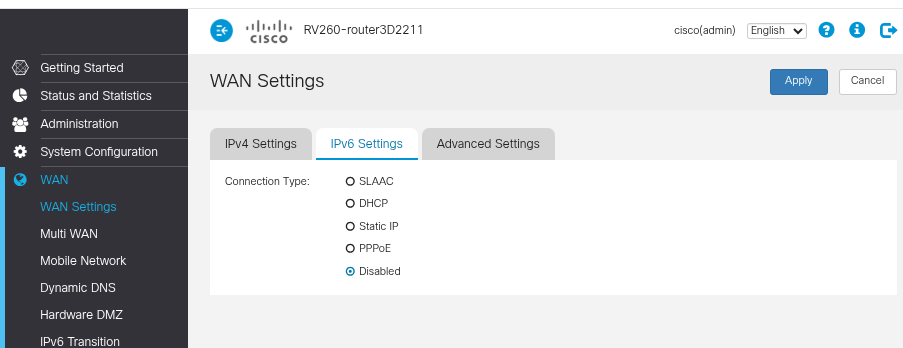

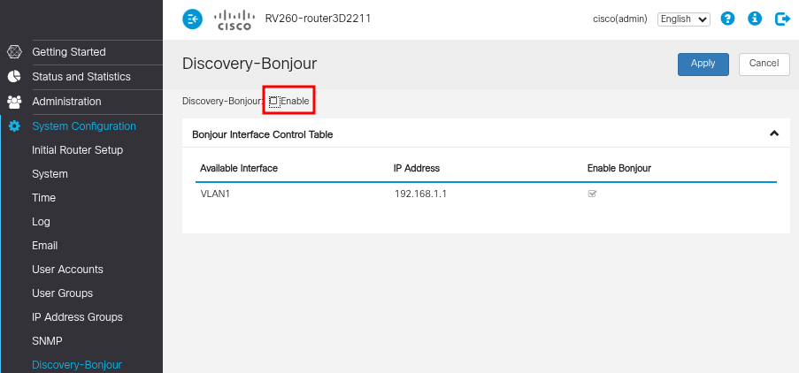

## Monitoreo y Registro

### Configuración de Logs

El registro adecuado es crucial para la detección y respuesta a incidentes:

1. Configure el registro de eventos de seguridad.

2. Establezca un servidor Syslog externo para almacenar los registros.

3. Habilite alertas para eventos críticos.

4. Configure la sincronización horaria mediante NTP para asegurar marcas de tiempo precisas en los registros.

5. Establezca una política de revisión regular de registros para identificar posibles amenazas o problemas.

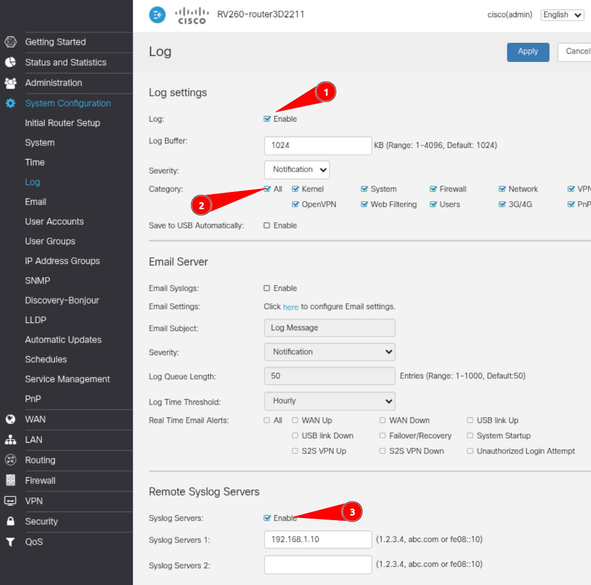

&nbsp;

## Consideraciones Adicionales de Seguridad

### Segmentación de Red

Implemente la segmentación de red mediante VLANs para limitar la propagación de amenazas:

1. Cree una VLAN.

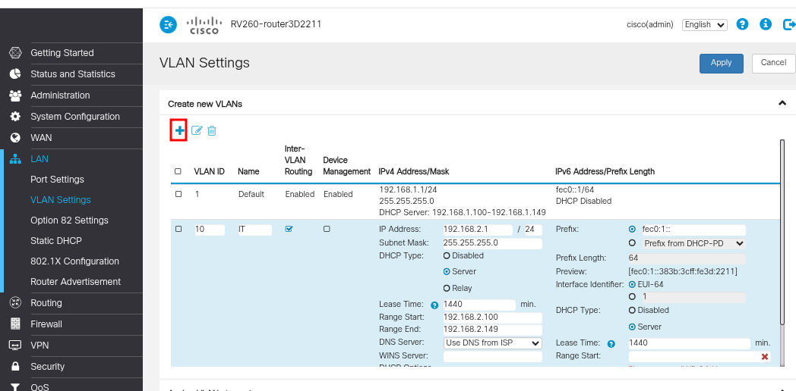

#### Recomendaciones
1. Configure VLANs para aislar diferentes tipos de tráfico y grupos de usuarios.

2. Establezca reglas de firewall entre las VLANs para controlar el tráfico que fluye entre ellas.

3. Considere la implementación de una DMZ (zona desmilitarizada) para alojar los servicios accesibles desde Internet.

### Seguridad Física

No descuide la seguridad física del dispositivo:

1. Ubique el router en un lugar seguro, preferiblemente dentro de un rack cerrado con llave.

3. Utilice el conector de seguridad Kensington (si está disponible) para asegurar físicamente el dispositivo y evitar robos.

4. Controle y restrinja el acceso físico al dispositivo y a los puertos de consola.

## Redirección de puertos

Unicamente redirigir los puertos necesarios.

Revisar periodicamente las reglas de redirección de puertos para cerrar los puertos que ya no sean necesarios. 

## Deshabilitar IPv6 (si no se utiliza)

Deshabilitar IPv6 reduce la superficie de ataque y simplifica la configuración, aunque implica la pérdida de las funcionalidades de IPv6.

&nbsp;

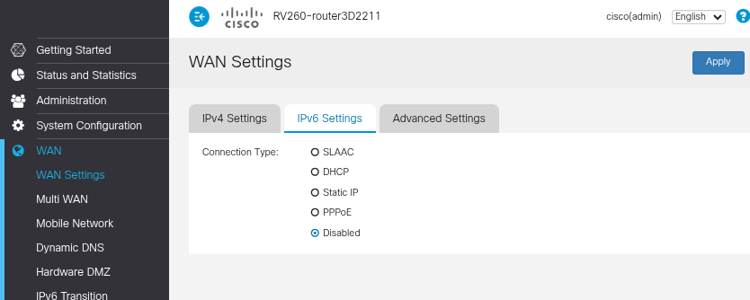

&nbsp;

### DMZ

Deshabilite la DMZ si no es necesaria. La DMZ abre todos los puertos hacia el host configurado, por lo que solo debe habilitarse en casos donde se requiera modificar la arquitectura de red.

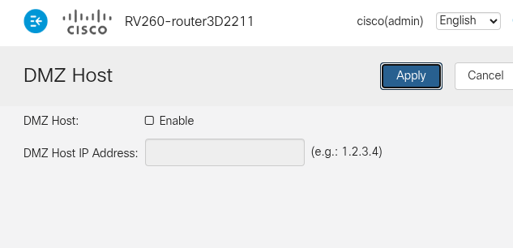

## Filtros de contenido

Es posible bloquear URLs o palabras clave.

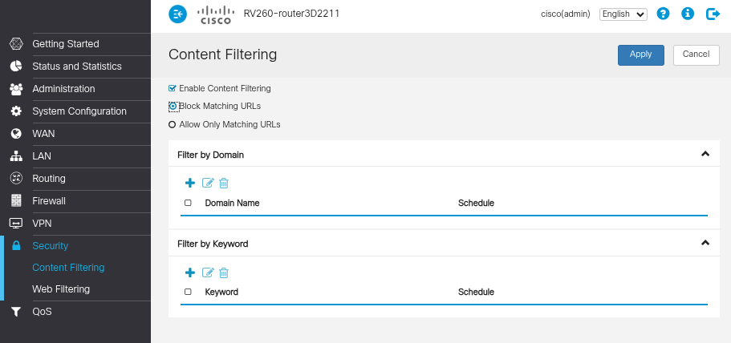

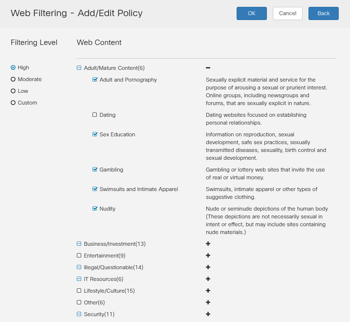

En este apartado, se pueden crear políticas para filtrar IPs, subredes o rangos de IP, incluso configurándolas para horarios específicos. Esta funcionalidad es útil para limitar la superficie de la red o bloquear ciberataques.

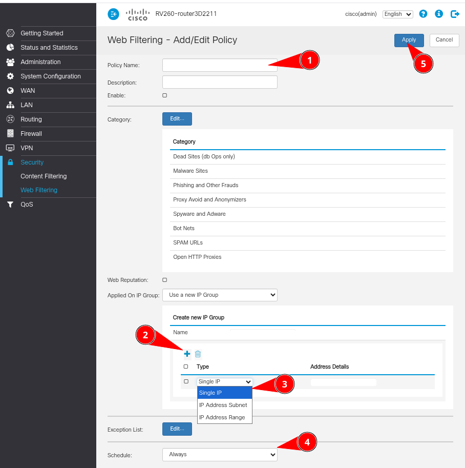

&nbsp;

También se pueden usar las reglas de filtrado web.

Configurar un servidor de correo electrónico para enviar alertas al administrador en caso de incidentes puede ser beneficioso para agilizar la respuesta ante un posible incidente.

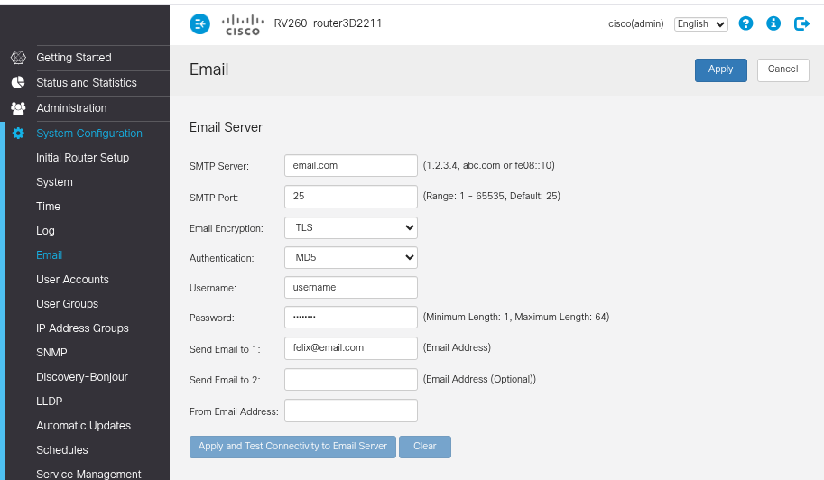

&nbsp;

## Guardar configuración

Una vez finalizada la configuración del router y tras verificar que los cambios funcionan correctamente, es imprescindible ir a la pestaña "Configuration Management" dentro de "Administración" y hacer clic en "Apply" para guardar los cambios y evitar que se borren al reiniciar el equipo.

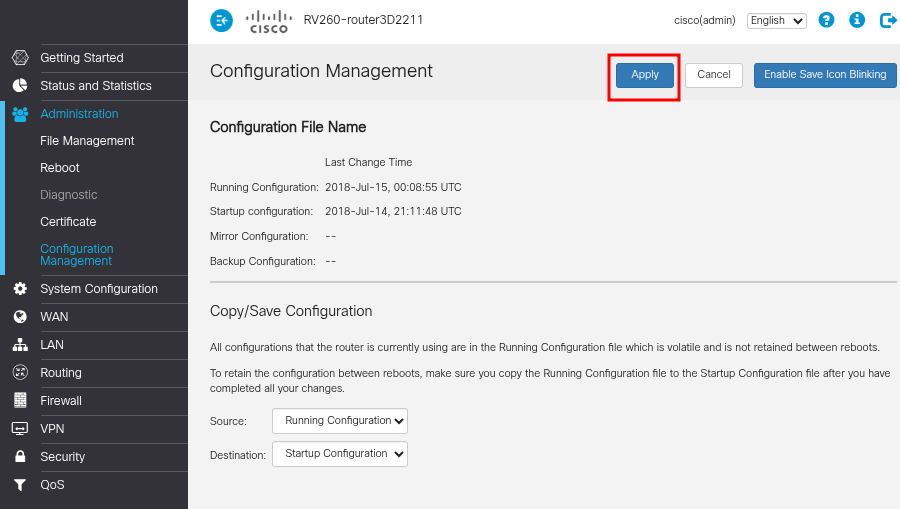

## Conclusión

El bastionado del router Cisco RV260 es un proceso que debe mantenerse con evaluaciones periódicas y ajustes conforme surjan nuevas amenazas. Esta guía proporciona los pasos esenciales para establecer una configuración de seguridad inicial que reduzca riesgos comunes en la red.

Es importante entender que el bastionado no es una tarea única, sino un esfuerzo continuo. La revisión regular de los logs, la atención a las alertas de seguridad y la actualización frente a nuevas vulnerabilidades son acciones necesarias para garantizar una protección efectiva.
